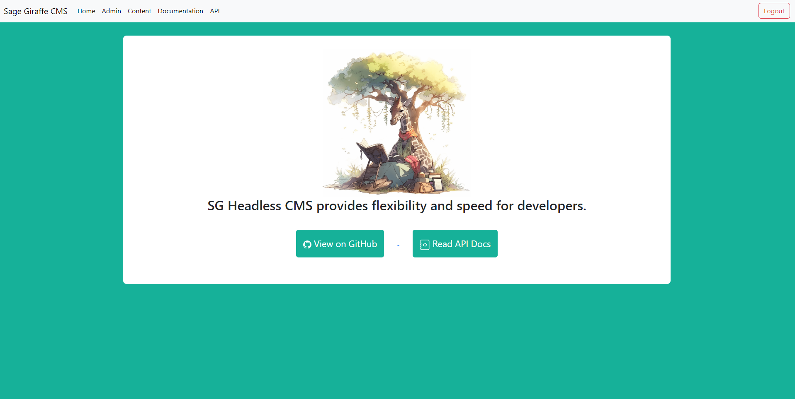

# sage-giraffe-headless-cms

## Project: Headless CMS


## Team: Sage Giraffe <br>
### Team Members:
- Casallas (https://github.com/DrMJK)
- Dev (https://github.com/devv64)
- Munnu (https://github.com/Manveer-Saini)
- Rob (https://github.com/robPTY)
- Seymone (https://github.com/seymoneg)
- 4orKe (https://github.com/gagepoling01)
- RegalLibrarian (https://github.com/RegalLibrarian)

Mentors: 
- nf3 (https://github.com/nf3)
- Nick (?)


## Description:
A headless CMS is a content management system that focuses solely on managing and delivering content, decoupled from the presentation layer or "head" of a website or application. Unlike traditional CMS platforms, a headless CMS does not dictate how the content is displayed. Instead, it provides a back-end infrastructure and an API that allows content creators to organize, create, and edit content, while developers have the freedom to deliver that content to various front-end channels. Us here at Sage Giraffe have created this Headless CMS with the purpose of providing that layer for the user to create/update their content. 

## Functionality: 
For more details on how to use the API, please visit our website. There, we have a fully fleshed out page on how to use certain endpoints, as well as a documentation section that properly explains the possibilities of each part of our CMS.

## Features
### Creation of Users:
```
python createUser.py <username> <password>
```

